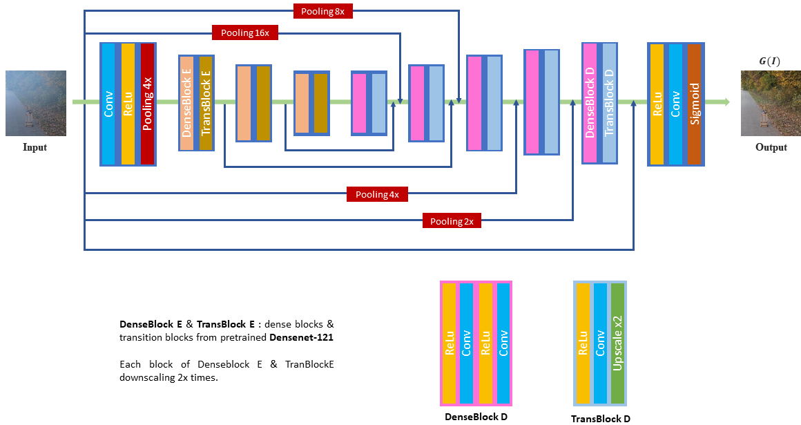
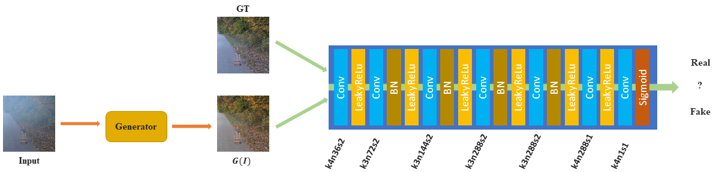
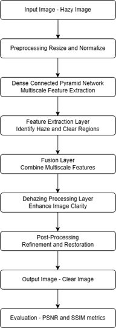
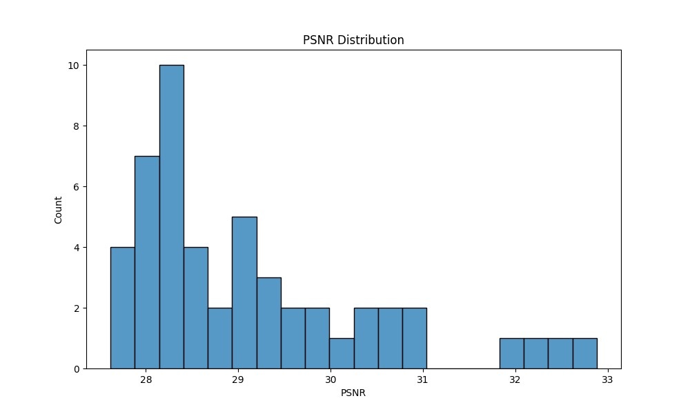
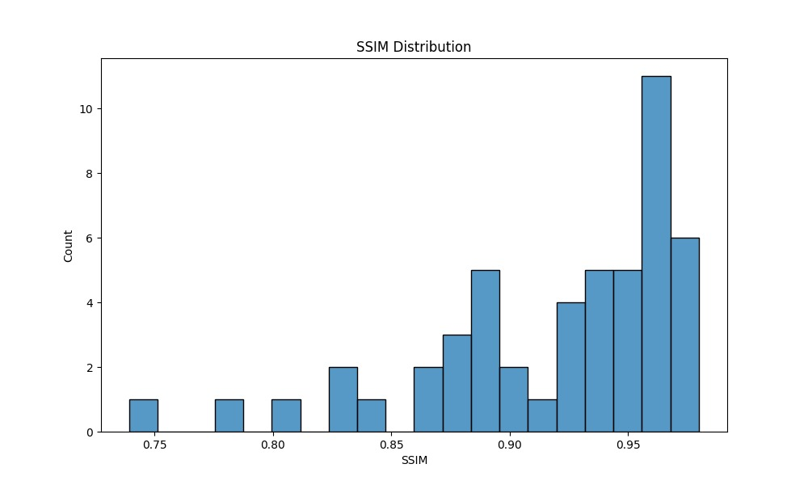
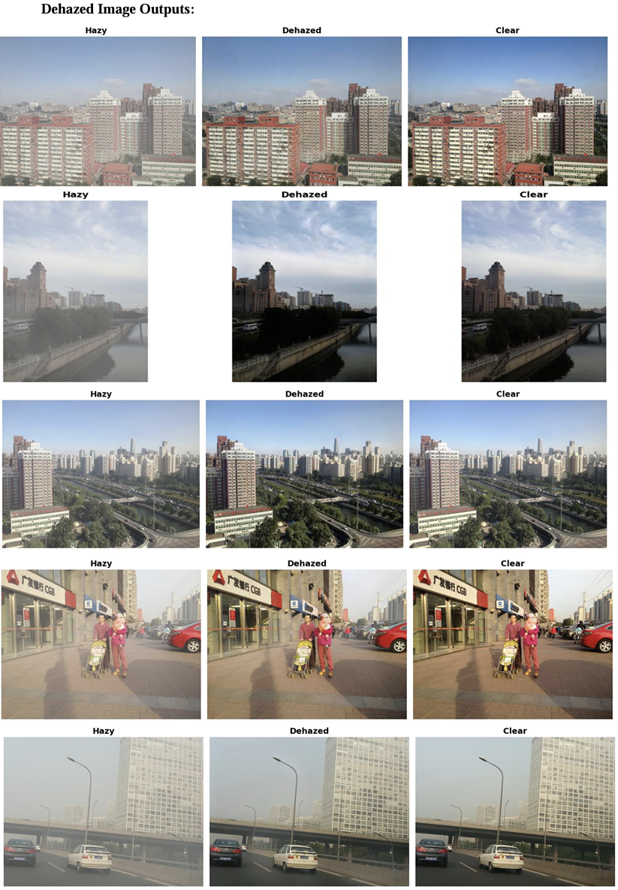

# PyTorch Image Dehazing

A GAN-based deep learning approach for removing haze from images. This repository implements a state-of-the-art image dehazing technique using Generative Adversarial Networks.



_Figure 1. Generator. The generator directly outputs haze-free images without estimation of intermediate parameters._




_Figure 2. Discriminator. The discriminator guides the generator to generate more realistic dehazed results._


## Project Structure

```
pytorch-image-dehazing/
│
├── compare_images.py     # Script to visualize and compare hazy, dehazed, and ground truth images
├── data.py               # Dataset loading and preprocessing logic
├── demo.py               # Run the model on single image(s) for quick testing
├── figs/                 # Project architecture images in GAN
│   ├── dehazed_outputs.png
│   ├── discriminator.png
|   ├── flowdiagram.png
│   ├── generator.png
│   ├── psnr_distribution.jpg
│   └── ssim_distribution.jpg
├── main.py               # Main script for training the model with wandb
├── metrics.py            # Image quality metrics like PSNR, SSIM and Entropy
├── model.py              # Generator model definition
├── preprocessing.py      # Preprocess the dataset like equal pairs
├── requirements.txt      # Python dependencies
├── test.py               # Script for evaluating model performance on test datasets
├── utils.py              # Utility functions (image transformations, tensor conversion, etc.)
├── vgg16.py              # VGG-16 model for perceptual loss (if used)
└── README.md             # Project documentation (this file)
```


## Table of Contents

- [Overview](#overview)
- [Environment Setup](#environment-setup)
- [Dataset](#dataset)
- [Training](#training)
- [Testing](#testing)
  - [Single Image Testing](#single-image-testing)
  - [Batch Processing](#batch-processing)
  - [Metrics Evaluation](#metrics-evaluation)
- [Image Comparison](#image-comparison)
- [Image Metrics](#image-metrics---psnr-ssim-entropy)
- [Pre-trained Models](#pre-trained-models)
- [Performance Metrics](#performance-metrics)
- [Troubleshooting](#troubleshooting)

## PROJECT FLOW DIAGRAM



## Overview

This project implements a GAN-based image dehazing model that can effectively remove haze from outdoor images. The architecture consists of a generator that directly produces dehazed images without estimating intermediate parameters, and a discriminator that guides the generator to produce more realistic results.

## Environment Setup

This project is designed to run on Kaggle, which provides free GPU acceleration and easy dataset access.

### Kaggle Setup

1. **Create a Kaggle account** if you don't have one at [kaggle.com](https://www.kaggle.com)

2. **Create a new notebook**:
   - Go to "Code" tab
   - Click "New Notebook"
   - Select "GPU" as accelerator type in the notebook settings

3. **Import the repository**:
   ```python
   !git clone https://github.com/sriharikrishna04/pytorch-image-dehazing-master
   %cd pytorch-image-dehazing-master
   ```

4. **Dependencies**:
   All required dependencies are pre-installed in Kaggle notebooks. For any additional packages:
   ```python
   !pip install tqdm numpy tensorflow tensorboardX torch Pillow torchvision wandb
   ```

5. **Weights & Biases (wandb) Setup**:
   ```python
   import wandb
   wandb.login(key="enter the key from the project created in wandb website")
   ```

## Dataset

This project uses the **O-HAZE Combined Dataset**:
- 537 pairs of ground truth and hazy images
- Available on Kaggle and Drive: [O-HAZE Combined Dataset](https://www.kaggle.com/datasets/varunadhithya/o-haze-combined)

### Dataset Organization

The O-HAZE Combined Dataset has the following structure:
```
o_haze/
└── o_haze/
    └── O-HAZY/
        ├── GT/
        │   ├── img1
        │   ├── img2
        │   └── ...
        └── hazy/
            ├── img1
            ├── img2
            └── ...
```

To use this dataset in Kaggle:
1. Go to the [O-HAZE Combined Dataset](https://www.kaggle.com/datasets/varunadhithya/o-haze-combined) page
2. Click "Add to Data" button
3. Select your notebook from the dropdown menu

The dataset will be available at: `/kaggle/input/o-haze-combined/`

## Training

### Training on O-HAZE Combined Dataset

In main.py, under function def train(args), line number 72,

```python
   wandb.init(project="[PROJECT_NAME]", entity="[ENTITY_NAME]", config=vars(args), resume="allow")
```
here, it is used like,

```python
   wandb.init(project="image-dehazing", entity="sriharikrishnacbe04-psg-college-of-technology", config=vars(args), resume="allow")
```

```python
!python main.py --data_dir [DATASET_DIR] \
                --gpu [GPU_ID] \
                --epochs [NUMBER_OF_EPOCHS_TO_TRAIN] \
                --period [TO_CREATE_CHECKPOINT_PERIODICALLY] \
                --checkpoint [PATH_FOR_MODEL]
```

### Training Parameters

You can customize the training process with the following parameters:

Example
```python
!python main.py --data_dir /kaggle/input/o-haze-combined/o_haze/o_haze/O-HAZY \
                --gpu 0 \
                --epochs 1625 \
                --period 10 \
                --checkpoint /kaggle/input/checkpoint-1620/checkpoint_epoch_1620.pth
```

Common parameters:
- `--data_dir`: Path to the dataset directory
- `--exp`: Experiment name for saving models and logs
- `--batch_size`: Default is 1
- `--p_factor`: Perceptual loss factor, default is 0.5
- `--g_factor`: GAN loss factor, default is 0.5
- `--glr`: Generator learning rate, default is 1e-4
- `--dlr`: Discriminator learning rate, default is 1e-4
- `--epochs`: Number of training epochs, default is 10000
- `--gpu`: GPU device ID to use

### Training Checkpoints (created during training period automatically):

Model checkpoints are saved periodically in the `results/[EXPERIMENT_NAME]` directory. These include:
- Generator model state
- Discriminator model state
- Optimizer states
- Scheduler states

To resume training from a checkpoint, use:
```python
!python main.py --data_dir [DATASET_DIR] \
                --gpu [GPU_ID] \
                --epochs [NUMBER_OF_EPOCHS_TO_TRAIN] \
                --period [TO_CREATE_CHECKPOINT_PERIODICALLY] \
                --checkpoint [PATH_FOR_MODEL]
```

## Testing

### Single Image Testing (Demo)

To test the model on a single image:

```python
!python demo.py --model [MODEL_PATH] --images [IMAGE_PATH] --gpu [GPU_ID]
```

Example:
```python
!python demo.py --model /kaggle/input/checkpoint-1260/checkpoint_epoch_1260.pth \
                --images /kaggle/input/o-haze-combined/o_haze/o_haze/O-HAZY/hazy/0063_0.8_0.16.jpg \
                --gpu 0
```

### Batch Processing Multiple Images

To process multiple images at once:

```python
!python demo.py --model [MODEL_PATH] --images [IMAGE1] [IMAGE2] [IMAGE3] ... --gpu [GPU_ID]
```

Example:
```python
!python demo.py --model /kaggle/input/checkpoint-1260/checkpoint_epoch_1260.pth \
                --images /kaggle/input/o-haze-combined/o_haze/o_haze/O-HAZY/hazy/0001_0.8_0.2.jpg /kaggle/input/o-haze-combined/o_haze/o_haze/O-HAZY/hazy/0002_0.8_0.2.jpg \
                --gpu 0
```

### Testing and Evaluating Metrics on Test Set

To evaluate the model on 50 random test images and calculate metrics:

```python
!python test_model.py --model [MODEL_PATH] \
                    --hazy_dir [HAZY_IMAGES_DIR] \
                    --gt_dir [GROUND_TRUTH_DIR] \
                    --output_dir [OUTPUT_DIR] \
                    --num_images 50 \
                    --gpu [GPU_ID]
```

Example:
```python
!python /kaggle/working/pytorch-image-dehazing/test.py \
         --model /kaggle/input/checkpoint-1260/checkpoint_epoch_1260.pth \
         --hazy_dir /kaggle/input/o-haze-combined/o_haze/o_haze/O-HAZY/hazy \
         --gt_dir /kaggle/input/o-haze-combined/o_haze/o_haze/O-HAZY/GT \
         --num_images 50 \
         --gpu 0
```

This will:
1. Randomly select 50 images from the test set
2. Process each image with the model
3. Calculate metrics (PSNR, SSIM, Entropy)
4. Generate visualizations of the metrics
5. Save all results to the output directory

## Image Comparison

To visually compare hazy, dehazed, and ground truth images:

```python
%run compare_images.py --hazy [HAZY_IMAGE_PATH] \
                       --dehazed [DEHAZED_IMAGE_PATH] \
                       --gt [GROUND_TRUTH_PATH] \
                       --save [OUTPUT_PATH]
```

Example:
```python
%run compare_images.py --hazy /kaggle/input/o-haze-combined/o_haze/o_haze/O-HAZY/hazy/0001_0.8_0.2.jpg \
       --dehazed /kaggle/working/pytorch-image-dehazing/outputs/0001_0.8_0.2.jpg \
       --gt /kaggle/input/o-haze-combined/o_haze/o_haze/O-HAZY/GT/0001.png
```

### Batch Comparison

To compare multiple images in batch mode:

```python
%run compare_images.py --batch \
                      --hazy_dir [HAZY_IMAGES_DIR] \
                      --dehazed_dir [DEHAZED_IMAGES_DIR] \
                      --gt_dir [GROUND_TRUTH_DIR] \
                      --save_dir [OUTPUT_DIR]
```

Example:
```python
%run compare_images.py --batch \
                      --hazy_dir /kaggle/input/o-haze-combined/o_haze/o_haze/O-HAZY/hazy \
                      --dehazed_dir /kaggle/working/outputs \
                      --gt_dir /kaggle/input/o-haze-combined/o_haze/o_haze/O-HAZY/GT \
                      --save_dir /kaggle/working/comparisons
```

## Image Metrics - PSNR, SSIM, ENTROPY

To measure the reality among hazy, dehazed, and ground truth images:

```python
!python metrics.py --hazy [HAZY_IMAGE_PATH] \
                   --dehazed [DEHAZED_IMAGE_PATH] \
                   --gt [GROUND_TRUTH_PATH] \
                   --save [OUTPUT_PATH]
```

Example:
```python
!python metrics.py --hazy /kaggle/input/o-haze-combined/o_haze/o_haze/O-HAZY/hazy/0001_0.8_0.2.jpg \
                   --gt /kaggle/input/o-haze-combined/o_haze/o_haze/O-HAZY/GT/0001.png \
                   --dehazed /kaggle/working/pytorch-image-dehazing/outputs/0001_0.8_0.2.jpg
```

## Pre-trained Models

Pre-trained models are available [here](https://drive.google.com/drive/u/0/folders/1m2xbpB42wlaRf4_Ilr1-fn2ToTcf-0Ca). Download and add to your Kaggle notebook.

The package includes:
- `checkpoint_epoch_1260`: Model trained on O-HAZE-COMBINED dataset

To add the pre-trained model to your Kaggle notebook:
1. Download the model from the Google Drive link
2. Go to "Data" tab in your Kaggle notebook
3. Click "Add Data" and upload the downloaded model
4. The model will be available at `/kaggle/input/your-model-name/`

## Performance Metrics

The models are evaluated using the following metrics:
- **PSNR** (Peak Signal-to-Noise Ratio): Measures the pixel-level accuracy
- **SSIM** (Structural Similarity Index): Measures the perceived quality
- **ENTROPY**: Measure of an image's information content

### Results

After evaluating the model on the O-HAZE Combined dataset, we achieved the following results:


.

```
Average Metrics on dehazed images:
## Performance Comparison

| **Metric** | **Before Dehazing**| **After Dehazing**|
|------------|--------------------|-------------------|
| PSNR       | 26.54 dB           | 30.55 dB          |
| SSIM       | 0.886              | 0.92              |

Entropy (GT): 7.39
Entropy (Dehazed): 7.36
Entropy (Hazy): 6.95

```

These results demonstrate:
1. High PSNR (30.55 dB): Indicating good pixel-level reconstruction quality
2. High SSIM (0.92): Showing strong structural similarity to ground truth
3. Entropy comparison: Dehazed images (7.36) have information content very close to ground truth (7.39), both significantly higher than hazy images (6.95)

The model successfully restores both visual quality and information content in hazy images, bringing them very close to the ground truth.

## Troubleshooting

### Common Issues

1. **Kaggle session timeout**
   - Kaggle sessions have a time limit; save your output files periodically
   - Use the "Commit" button to save your notebook progress

2. **GPU memory limitations**
   - Reduce batch size if encountering CUDA out of memory errors
   - Kaggle provides P100 GPUs with 16GB of memory

3. **Dataset access issues**
   - Ensure the dataset is properly added to your notebook
   - Check the paths using `!ls /kaggle/input/o-haze-combined/`

### Getting Help

If you encounter any issues or have questions, please open an issue in the repository.

## References

1. Densely Connected Pyramid Dehazing Network (CVPR'2018)
2. FD-GAN: Generative adversarial Networks with Fusion-discriminator for Single Image Dehazing (AAAI'20)
3. Multi-scale Single Image Dehazing using Perceptual Pyramid Deep Network (NTIRE-2018-Dehazing-Challenge)

---

If you find this repository useful, please give it a star! Thank you!
